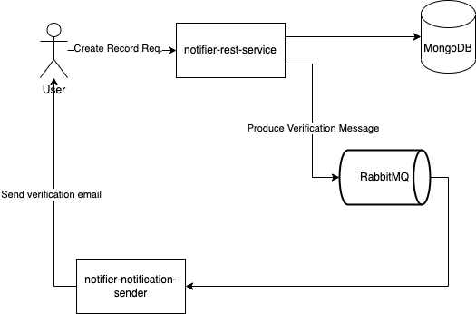

# Price Notification App
This app is a simple app to help you track the prices of your favorite products and receive notifications when the prices change.
It is written in Scala and uses the Cats Effect library to manage asynchronous effects.

## Prerequisites
To run this app, you will need to have the following installed on your system:
- Scala 2.13
- sbt 1.4

## Setup
To get started with this app, clone the repository to your local machine:
```bash
git clone https://github.com/dagdelenmustafa/price-notifier.git
cd price-notifier
```

and prepare the environment with docker compose. It will create the required containers and also the required queues and binding in RabbitMQ.
```bash
cd docker
docker-compose up
```

## Dependencies
This app uses the following dependencies:

- **<u>Cats Effect</u>** for managing asynchronous effects.
- **<u>Fs2</u>** for working with streams of data.
- **<u>http4s</u>** for making HTTP requests.
- **<u>Circe</u>** for parsing JSON data.
- **<u>RabbitMQ</u>** for messaging between services.
- **<u>MongoDB</u>** to store data.

## Flows



## License
This project is licensed under the [Apache-2.0](https://www.apache.org/licenses/LICENSE-2.0).
